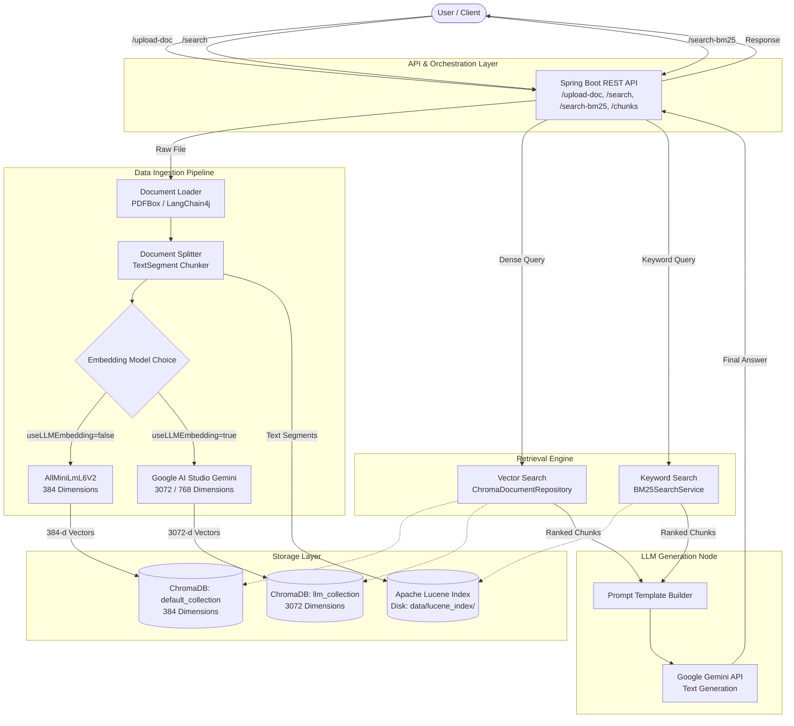

# System Architecture

The Hybrid RAG (Retrieval-Augmented Generation) system is designed with a microservices/modular approach, divided into 4 isolated layers to ensure scalability, maintainability, and enterprise-grade performance.

## 1. API & Orchestration Layer (Spring Boot)
This is the entry point of the system. It exposes RESTful endpoints for client applications to interact with.
- **Key Implemented Endpoints:** 
  - `POST /api/v1/documents/upload-doc`: Ingests documents (PDF/Text), generates embeddings, and saves to vector store & Lucene BM25 index.
  - `GET /api/v1/documents/search`: Performs similarity vector search against ChromaDB.
  - `GET /api/v1/documents/search-bm25`: Performs exact keyword search using Apache Lucene BM25 algorithm.
  - `DELETE /api/v1/documents/chunks/{id}`: Deletes a specific chunk by ID.
  - `DELETE /api/v1/documents/chunks/batch`: Deletes a batch of chunks by IDs.
- **Responsibilities:** Request validation, routing, error handling, and orchestrating calls across storage and retrieval engines.

## 2. Data Ingestion Pipeline
Responsible for processing raw documents and preparing them for search.
- **Responsibilities:** 
  - Reading PDF/Text documents using Apache PDFBox parser.
  - Chunking text into segments.
  - Dual Embedding Generation: Supports local `AllMiniLmL6V2EmbeddingModel` (384-d) and Google AI Studio `GoogleAiEmbeddingModel` (e.g. `gemini-embedding-2` / `text-embedding-004`).
  - Dual Vector Storage: Pushing data to separate ChromaDB collections (`hybrid_rag_default_collection` vs `hybrid_rag_llm_collection`) based on dimension compatibility.
  - Disk-backed BM25 Indexing: Persisting text segments to Apache Lucene disk storage (`data/lucene_index/`).

## 3. Retrieval & Reranking Engine
The core search engine of the RAG system, implementing the Hybrid Search strategy.
- **Responsibilities:** 
  - Accepting user queries and converting them to embeddings.
  - **Dense Search**: Querying ChromaDB using Cosine / L2 distance similarity search.
  - **Sparse Search**: Querying Apache Lucene index using BM25 ranking algorithm with OR operator matching.
  - **Parallel Search & Fusion**: Executing vector search and BM25 search in parallel, combined via scoring.

## 4. LLM Generation Node
The final node that interacts with the Generative AI model to produce the final answer.
- **Responsibilities:** 
  - Constructing the final prompt template by combining the top reranked chunks with the original user query.
  - Hitting the LLM (Gemini API) for text generation.
  - Returning the structured response back to the API layer.

---

## Architecture Diagram



---

## Folder Structure

The project follows a standard Spring Boot layered architecture:

```text
java-hybrid-rag/
├── src/
│   ├── main/
│   │   ├── java/
│   │   │   └── com/hybridrag/
│   │   │       ├── Application.java               # Spring Boot Entry Point (.env loader)
│   │   │       ├── controller/                    # API Controllers (DocumentController, DocumentSearchController)
│   │   │       ├── dto/                           # Data Transfer Objects (SearchResultDto)
│   │   │       ├── service/                       # Business Logic (DocumentIngestionService, DocumentSearchService, BM25SearchService)
│   │   │       ├── repository/                    # ChromaDB Access (ChromaDocumentRepository)
│   │   │       ├── config/                        # Spring Configurations (ChromaDbConfig, EmbeddingConfig)
│   │   │       └── exception/                     # Global Exception Handler (GlobalExceptionHandler)
│   │   └── resources/
│   │       └── application.properties             # App configurations, env key bindings
│   └── test/
│       └── java/
│           └── com/hybridrag/                     # Unit and Integration Tests
├── data/
│   └── lucene_index/                              # Persistent Lucene BM25 Disk Index
├── docs/                                          # Project Architecture & Setup Guides
├── .env                                           # Environment variables (GEMINI_API_KEY, etc.)
├── .gitignore                                     # Git Ignore Rules
├── pom.xml                                        # Maven Dependencies
└── docker-compose.yml                             # Docker setup for ChromaDB (v0.5.23)
```
