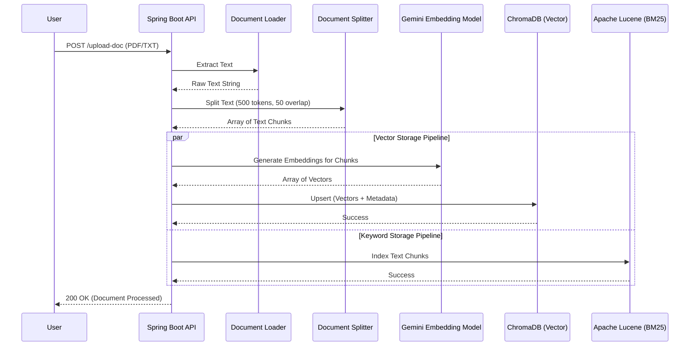
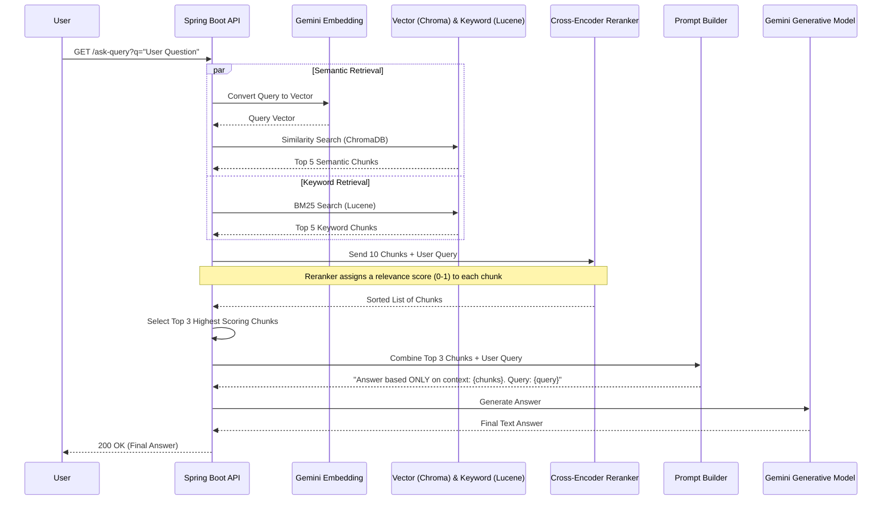

# Data Flow Diagrams (DFD)

This document outlines the step-by-step data flow for the two main processes in the Hybrid RAG system: Document Ingestion and Query Resolution.

## 1. Document Ingestion Flow (Level 1 DFD)

This flow describes how an uploaded document is processed and stored in both the Vector Database (for semantic search) and the Sparse Index (for keyword search).

## 2. Hybrid Search & Query Generation Flow (Level 1 DFD)

This flow describes how a user's question is answered using parallel retrieval, cross-encoder reranking, and final LLM generation.

